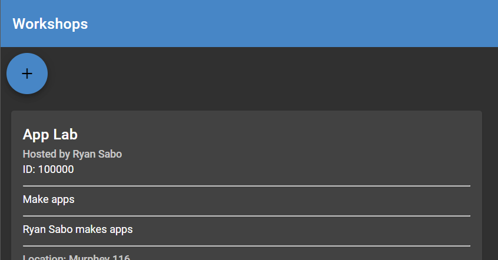
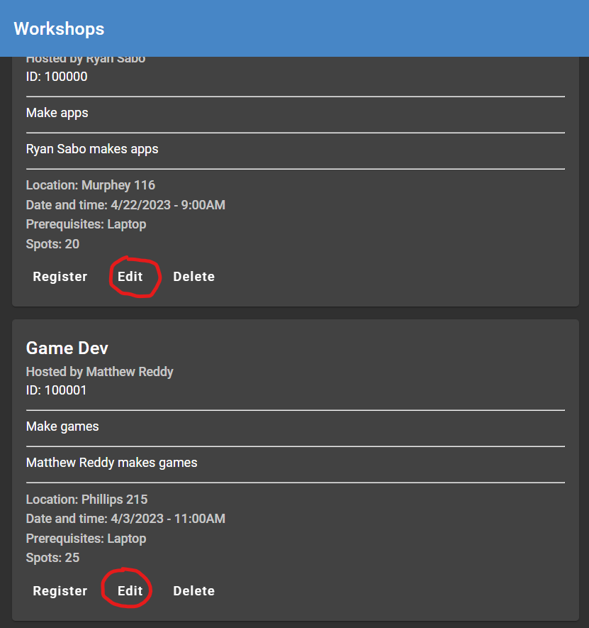
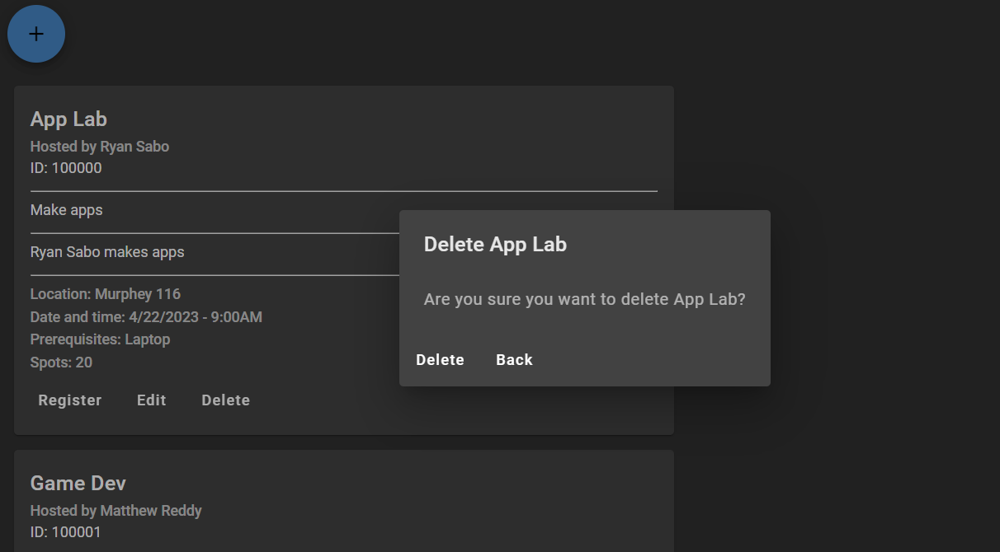
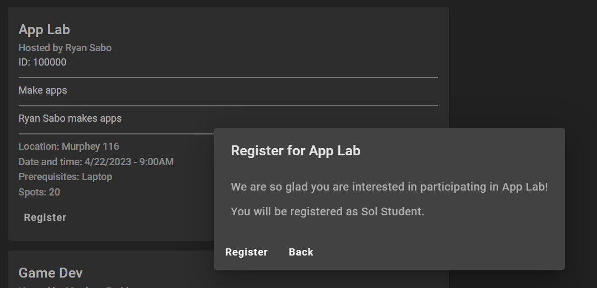
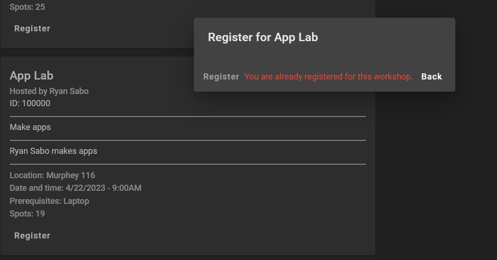

# COMP 423 Final Project: Workshops

Link to the webpage deployed on Carolina CloudApps: https://team-f7-comp423-23s.apps.cloudapps.unc.edu/

### Authors

- [Matthew Reddy](https://github.com/matthewreddy), Technical Lead
- [Ryan Sabo](https://github.com/RyanSabo), Engineer
- [Andy Dong](https://github.com/aandime), Engineer
- [Chase Allen](https://github.com/frchase), Engineer

## Introduction and Overview

Our team has written full stack implementation for workshops on the CSXL website. Upon opening the website, this can be found by clicking on the **Workshops** tab on the sidebar. We have written full functionality for creating a new workshop and adding it to an underlying database. We have also implemented the ability to edit and delete a workshop, and users are free to register for any workshop available.

The workshop model, which can be found on the backend in `backend/models/workshop.py` and found on the frontend in `frontend/src/app/workshop/workshop-service.ts`, is defined by several fields:

1. id: An integer. The unique, six-digit identifier for each workshop.
2. title: A string. The title of the workshop.
3. description: A string. A brief description of the workshop material.
4. host_first_name: A string. The first name of the host of the workshop.
5. host_last_name: A string. The last name of the host of the workshop.
6. host_description: A string. A brief description of the host of the workshop.
7. location: A string. Specifies the location of the workshop.
8. time: A string. Specifies the date and time the workshop will occur.
9. requirements: A string. Specifies prerequisites to complete before attending the workshop.
10. spots: An integer. The amount of spots available for the workshop.
11. attendees: A list of users. The list of each user that is registered for the workshop.

All of these fields have been translated to mapped columns that can be understood by a SQLAlchemy database. The entity with this information can be found at `backend/entities/workshop_entity.py`.

Certain features, such as creation, deletion, and modification of a workshop, are limited only to users who have administrative permissions. This document will cover those features first, and then move on to workshop registration, which can be done by any user.

It is important to note that all features follow the same fundamental progression. In some way, an action is performed, and data is specified by the user on the frontend. The data is then taken by a workshop component (found in `frontend/src/app/workshop`) and passed to the frontend workshop service, which is injected into each workshop component. The service calls on the API on the backend via a specified route. This can be found at `backend/api/workshop.py`. The data is then given to the workshop service on the backend (found in `backend/services/workshop.py`), which performs the task and yields the database. Results are returned to the frontend in the form of an `Observable`, which is then subscribed to by the component, and the view refreshes itself to display the changes. This process is important to understand since it is fundamental to all of our features.

## Admin-Only Features

### Workshop Creation

Implementation for creation of a workshop on the frontend can be found by navigating to `frontend/src/app/workshop/workshop-create`. For this feature (and several others), our team opted to use Angular Material's **dialog box**, which is opened by a button at the top of the workshop page. Upon navigating to the website and authenticating as the *Super User* profile by adding `/auth/as/user/999999999` at the end of the URL, the button is displayed on the webpage.

When the administrator clicks the button, the `openCreateDialog()` method is called in `workshop-component.ts`. This calls on the component defined in the `/workshop-create` directory to display the dialog box and the required form fields that define a workshop for the administrator to fill out. It will also randomly generate a six-digit unique identifier for the workshop that they are about to create. Once the values are validated by the component and then submitted, they are sent to the workshop service on the frontend, which calls on the underlying backend API. The backend workshop service adds a new entry to the database for the workshop and returns it in the form of an `Observable<Workshop>`, which is subscribed to by the component.

### Workshop Modification

This feature is very similar to workshop creation; however, there is one key difference: there is an **Edit** button for each workshop listed.

For this feature, our team also decided to utilize dialog boxes. However, to account for the difference of each individual workshop having its own edit button, it is necessary to be able to pass the workshop being referred to from the base component, `workshop-component.ts`, to the dialog component, `workshop-edit/workshop-edit-component.ts`. This was accomplished in the form of `DialogData` that can be injected directly into the dialog component, as supported by Angular Material. 

The data used is called `WorkshopDialogData`, and it is defined in `workshop-component.ts`. It simply contains the workshop that the task will be performed on; in this case, the workshop that will be edited.

When an administrator clicks the **Edit** button under a certain workshop, the `workshop-edit-component` is invoked, and the new dialog box is opened. Modification of the workshop ID is not allowed, but the administrator is free to change any other field provided. With the workshop being injected into the component, we are able to automatically fill in values from what the workshop was previously defined to be, which is accomplished in the `ngOnInit()` method. Like the creation feature, the data will be taken once submitted and sent from frontend to backend via the API. Then, in the backend, the service looks for the workshop with the same ID and updates it with the newly entered information. It returns the fresh workshop in the form of an observable, which is subscribed to by the component on the frontend.

### Workshop Deletion

This feature is also similar to the previous components. However, there are no values to collect. The program will simply open a dialog box asking for confirmation to delete the specific workshop.

`WorkshopDialogData` is used again to pass the title of the workshop to the header of the dialog box, simply to confirm to the administrator that it is the workshop that they are wanting to delete. It is also passed into the service once the delete button is submitted. The service again calls on the API, which forwards the instruction to the workshop service. The service then queries the database and deletes the specified entry corresponding to the workshop's ID. Nothing is returned from this operation, so the component simply subscribes to an `Observable<null>`.

## Features for All Users

### Workshop Registration

This feature is a fair bit different from the others and will be described in more detail. Our team started work on this feature by implementing a form and having the user fill out all values that they wanted to be registered for the workshop. However, we felt that the user should not have to reenter their name and PID when this information is already collected in their profile. As a result of this, we decided to have the `WorkshopRegisterComponent` depend on the `ProfileService`, which provides an observable that holds the profile that is currently logged in to the website. This profile is then taken and registered for the workshop.

Our team also needed to determine a way to maintain a list of users in the workshop model. This is a simple process when defining the model, but when matching this to a corresponding entity to be held in a database, it becomes trickier. To address this, we created a new table that can be found by navigating to `backend/entities/workshop_user_entity.py`. The table only maintains two columns: the user ID that is registered for a workshop, and the workshop ID that the user is registered to. This table is the secondary table that is mapped to the `attendees` field in the `WorkshopEntity`.

When a user clicks the **Register** button, a dialog box will display, asking for confirmation to ensure that they want to be registered under the profile that is currently logged in by stating their name.

When the user confirms their registration, the profile and the workshop are both passed from the component to the service. This information is passed through the API to the backend service, which queries the database and creates a new entry in the secondary `workshop_user` table.

To ensure that the same user is not able to register twice for the same workshop, another backend method is utilized to return a list of all users registered for a specific workshop. Each time the `WorkshopRegisterComponent` is initialized and constructed, it calls on the service, which communicates through the API to the backend service, which returns the `Observable<Profile[]>` that holds the list of all profiles registered for the given workshop. Back in the frontend component, this observable is subscribed to, and the list is filtered to see if the user currently exists there. This result is stored in a boolean field, which controls whether the **Register** button is disabled for the user. It also displays an error for the user to see, shown in the screenshot below.

If the user is successfully registered, the workshop service in the backend also decrements the available spots by one, and the webpage is refreshed to show this.

## Closing Remarks

Our goals from the last sprint were to implement the design of the webpage and add modification functionality for each workshop. Each of these goals has been completed to provide a complete, fully functional product that can be used by students and faculty of the UNC CSXL to represent workshops.

Our team has been thrilled at the opportunity to challenge ourselves and implement extensive front-to-back features that can be used by the UNC CS community for the benefit of everyone. We hope that this documentation fosters a great understanding of how each feature works in detail.
